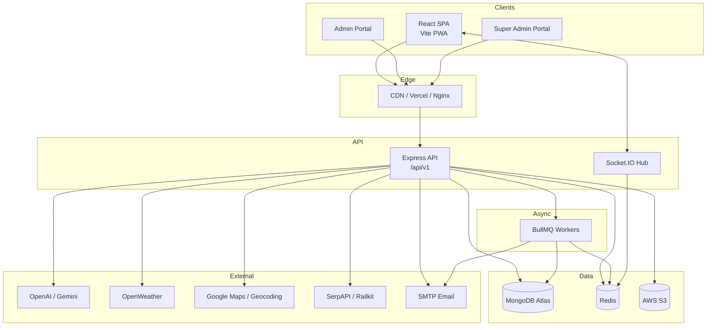
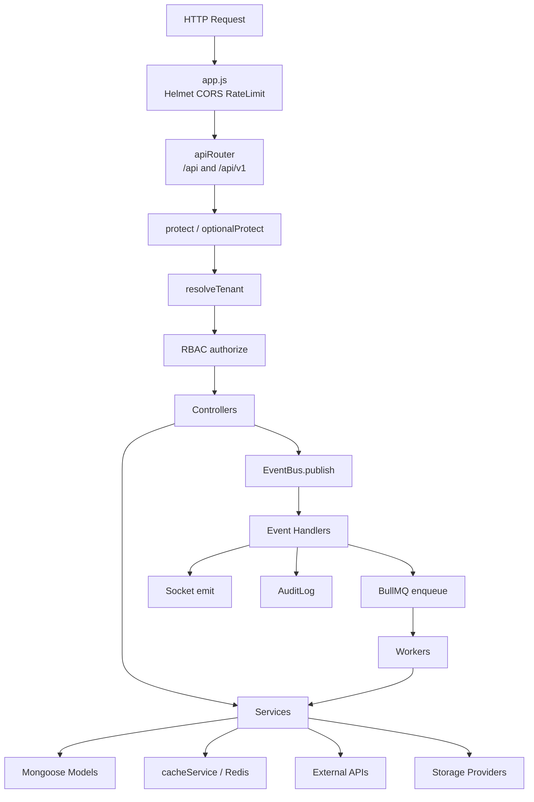
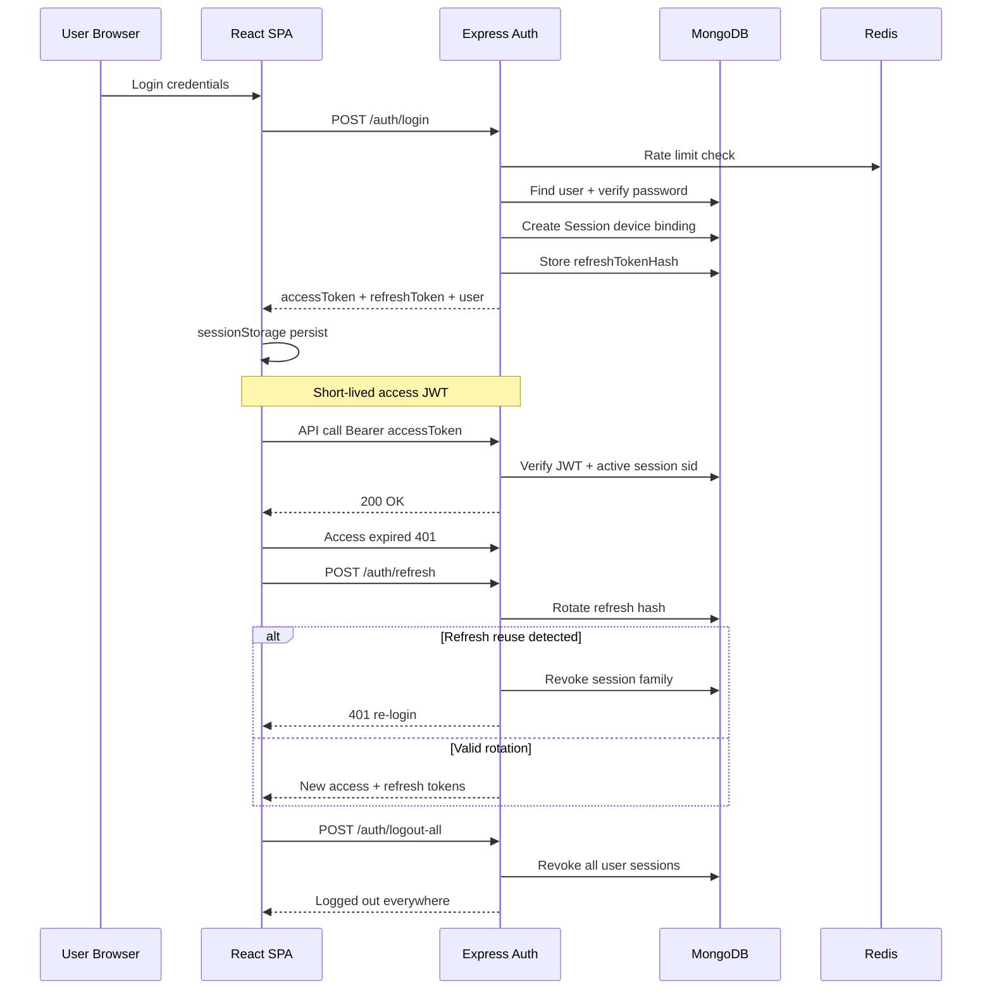
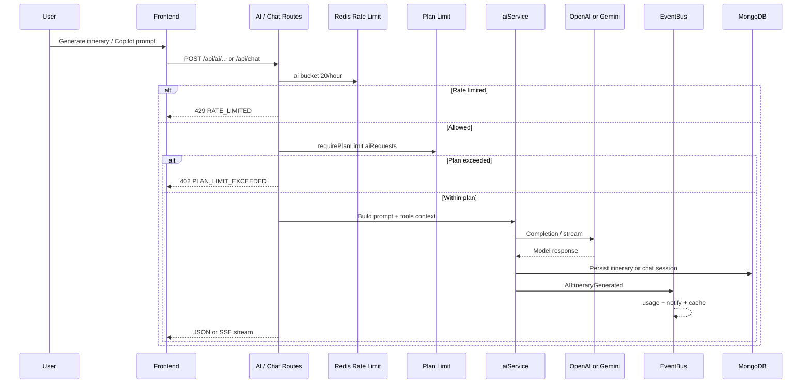
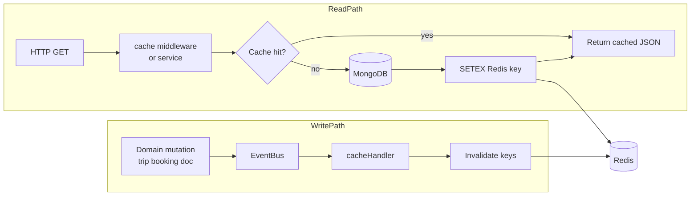
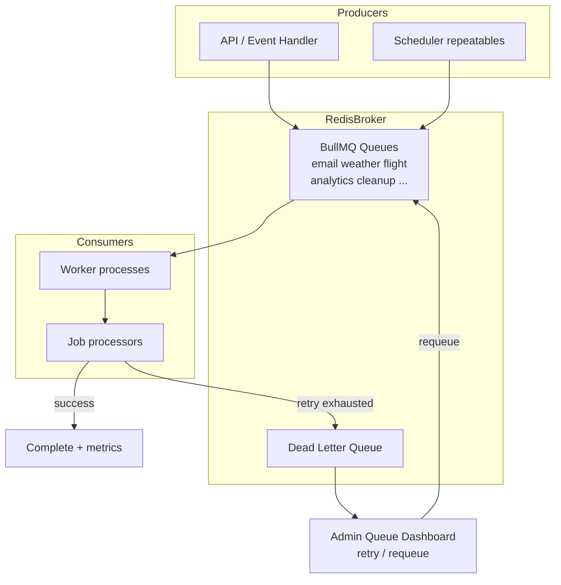
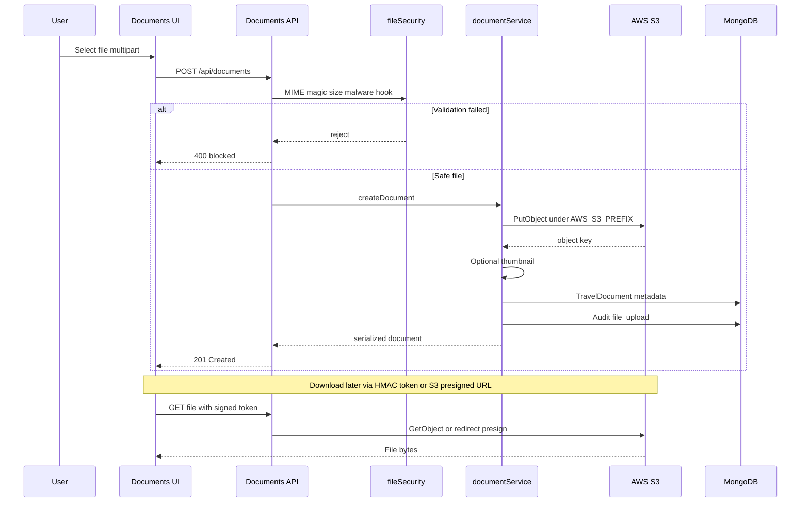
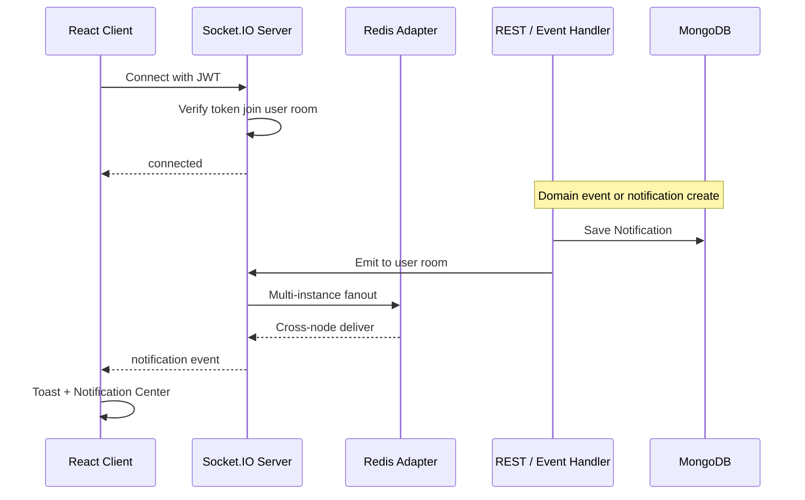
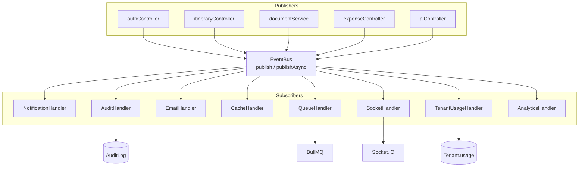
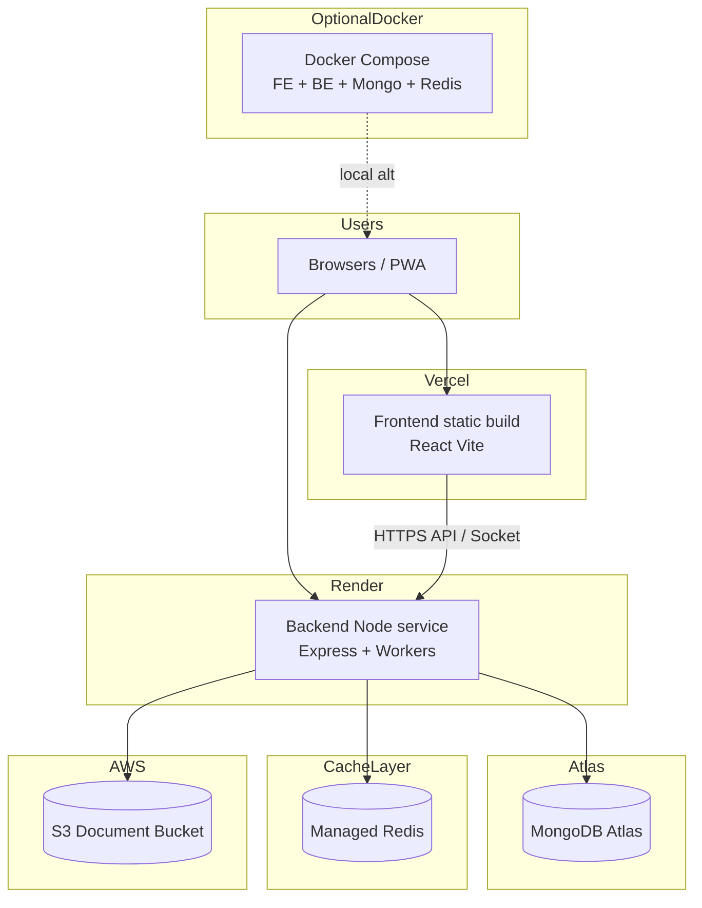

# TravelPlan — Architecture Diagrams

Mermaid diagrams for the TravelPlan platform. They render natively on GitHub (and most Markdown previewers that support Mermaid).

> Tip: If a preview client fails to render, open this file on github.com — Mermaid is built into GitHub Markdown.

---

## 1. High-Level System Architecture



---

## 2. Backend Architecture



---

## 3. Authentication Flow



---

## 4. AI Request Flow



---

## 5. Redis Cache Flow



---

## 6. BullMQ Queue Flow



---

## 7. AWS S3 Upload Flow



---

## 8. Socket.IO Notification Flow



---

## 9. Event-Driven Architecture



---

## 10. Deployment Architecture



---

## Embedding in README

Link from the main README:

```markdown
See [ARCHITECTURE.md](./ARCHITECTURE.md) for Mermaid system diagrams.
```

Or paste any ` ```mermaid ` block directly into GitHub-flavored Markdown files or PR descriptions.

---

## GitHub Mermaid tips used here

- Prefer `flowchart` / `sequenceDiagram` (widely supported)
- Quote labels that contain special characters via `<br/>` line breaks inside node text
- Avoid reserved node IDs such as `end`
- Keep subgraph titles simple
- No HTML entity hacks that break the Mermaid parser
