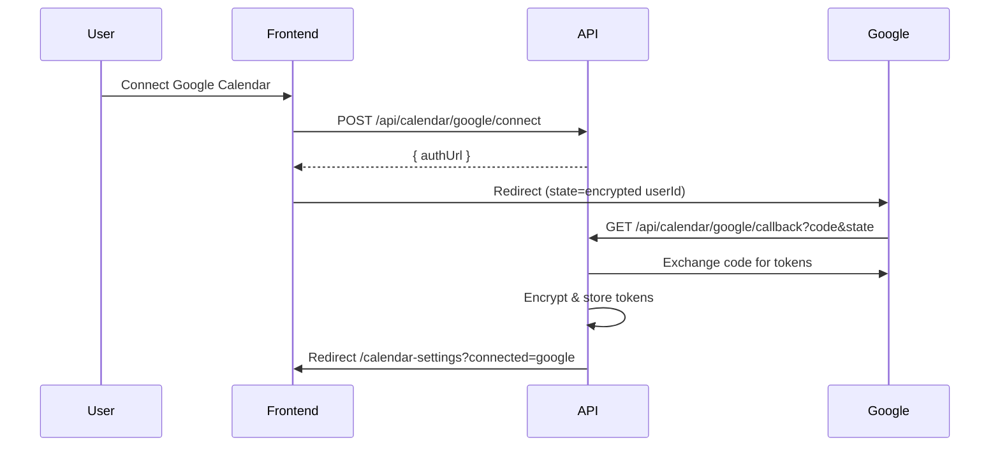

# Calendar Integration

Sync trip plans with **Google Calendar**, **Microsoft Outlook**, and **Apple Calendar** (.ics).

## OAuth Flow

1. User clicks **Connect** → backend returns OAuth URL with encrypted `state`.
2. Provider redirects to `/api/calendar/{provider}/callback`.
3. Tokens exchanged, **AES-256-GCM encrypted** in `CalendarIntegration`.
4. Refresh tokens used automatically before expiry.

## Database

### CalendarIntegration
| Field | Purpose |
|-------|---------|
| userId + provider | Unique connection |
| accessTokenEnc / refreshTokenEnc | Encrypted OAuth tokens |
| tokenExpiry | Auto-refresh |
| lastSync | Status display |
| autoSync | Incremental sync on trip change |

### CalendarEventLink
Maps local entity → external event ID for create/update/delete without duplicates.

| Field | Purpose |
|-------|---------|
| uid | Stable event key (`travelplan-{tripId}-activity-{id}`) |
| syncHash | Content hash — skip unchanged events |
| externalEventId | Google/Outlook event ID |

## Calendar Mapping

| Source | Start | End | Title |
|--------|-------|-----|-------|
| Activity | Day date + activity time | + duration | `{name} — {trip}` |
| Flight/hotel booking | departureDate / checkIn | arrival / checkOut | Type icon + provider |
| Imported ICS | DTSTART | DTEND | SUMMARY |

Includes: description, location, coordinates (GEO in ICS), trip name, notes.

## Sync Algorithm

1. `buildTripCalendarEvents(itinerary, bookings)` → sorted events.
2. `detectConflicts()` → overlaps + duplicates.
3. For each connected provider with `autoSync`:
   - Compare `syncHash` with `CalendarEventLink`.
   - **Unchanged** → skip API call.
   - **New/changed** → create or update provider event.
   - **Removed locally** → delete external event + link.
4. `notifyCalendarSync()` → in-app notification.

**Triggers:** itinerary create/update, booking create/update/delete.

## ICS Export / Import

- **Export:** `POST /api/calendar/export` → RFC 5545 `.ics` (Apple Calendar, any client).
- **Import:** `POST /api/calendar/import` with ICS text → merged + conflict check.

No OAuth required for ICS.

## API

| Method | Endpoint |
|--------|----------|
| GET | `/api/calendar/status` |
| POST | `/api/calendar/google/connect` |
| POST | `/api/calendar/google/disconnect` |
| POST | `/api/calendar/outlook/connect` |
| POST | `/api/calendar/outlook/disconnect` |
| GET | `/api/calendar/events?tripId=` |
| GET | `/api/calendar/trip/:tripId/status` |
| POST | `/api/calendar/sync` |
| POST | `/api/calendar/export` |
| POST | `/api/calendar/import` |

## How to Test

### Without OAuth (ICS)
1. Open a trip → **Calendar Sync** → **Export .ics**.
2. Open file in Apple Calendar or Google Calendar (import).
3. **Import .ics** with events from another calendar.

### With Google
1. Create OAuth credentials in Google Cloud Console (Calendar API enabled).
2. Set `GOOGLE_CALENDAR_*` in `backend/.env`.
3. `/calendar-settings` → Connect Google.
4. Edit itinerary → verify auto-sync notification.
5. Manual **Sync Google** on trip page.

### With Outlook
1. Register app in Azure Portal → Graph `Calendars.ReadWrite`.
2. Set `MICROSOFT_*` in `.env`.
3. Connect at `/calendar-settings`.

### Conflicts
Add two activities same day/time → conflict banner on trip calendar panel.

## Files

| Path | Role |
|------|------|
| `backend/models/CalendarIntegration.js` | OAuth storage |
| `backend/models/CalendarEventLink.js` | Sync mapping |
| `backend/utils/calendarMapper.js` | Event builder |
| `backend/utils/icsService.js` | ICS parse/generate |
| `backend/utils/tokenEncryption.js` | Token + state crypto |
| `backend/services/googleCalendar/` | Google API |
| `backend/services/outlookCalendar/` | Microsoft Graph |
| `backend/services/calendar/calendarSyncService.js` | Orchestrator |
| `frontend/src/components/calendar/` | UI |
