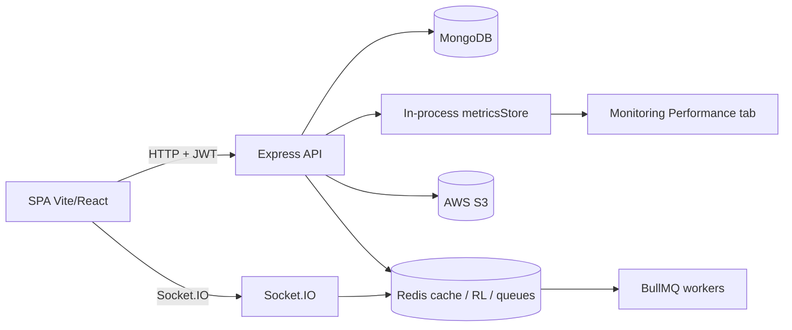
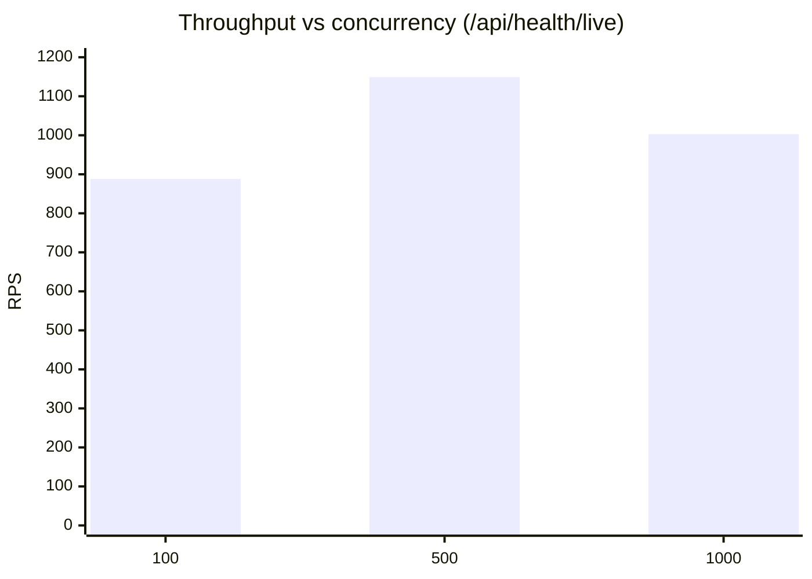
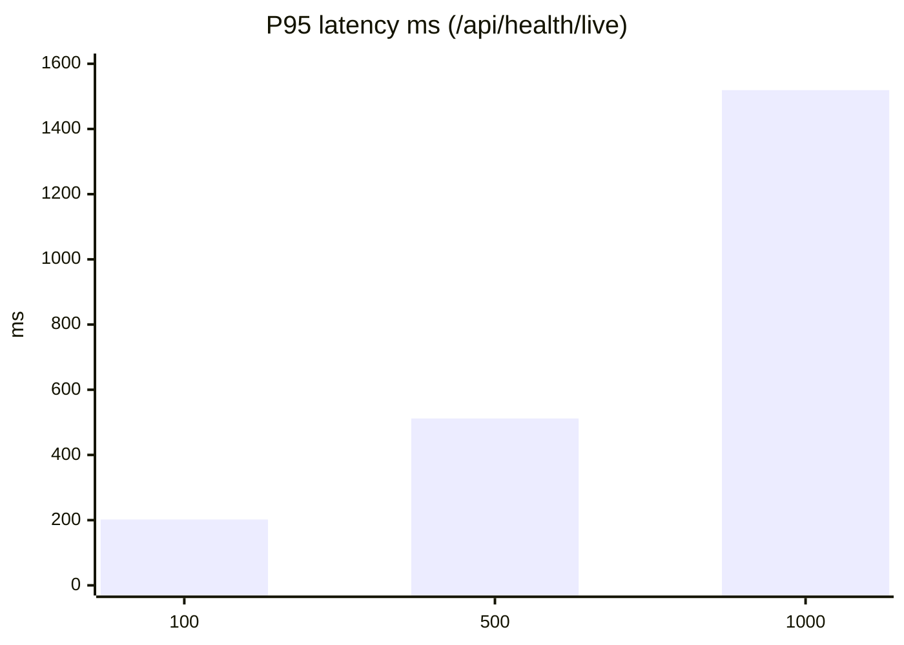

# PERFORMANCE.md — TravelPlan Performance Engineering Report

**Product:** TravelPlan (AI Travel Management Platform)  
**Stack:** MERN · Redis · BullMQ · Socket.IO · AWS S3 · Docker · CI/CD  
**Role:** Principal Performance Engineer  
**Date:** 2026-07-15  
**Constraint:** No business-logic rewrites; optimizations are measurable only.

---

## 1. Executive summary

This pass focused on **index coverage**, **payload reduction on list endpoints**, **Redis cache hygiene**, **route-level code splitting**, **observability (P50/P95/P99 + Mongo timing)**, and **load-test tooling**.  

| Area | Result |
|------|--------|
| MongoDB | Compound indexes synced for itineraries, bookings, users, audit, notifications, sessions, tenants, expenses, documents, activities |
| API list endpoints | Dropped deep day/activity graphs on list/saved; bookings list excludes attachment blobs |
| Health under load | `/api/health/live` + health-result cache (default 5s): **0% error** at 1000 VUs (was ~88% errors on full health before) |
| Frontend bundle | Route-level `React.lazy` — admin/maps/analytics/chat are separate chunks |
| Monitoring | New **Performance** tab: latency, memory/CPU, Redis hit %, Mongo query time |
| Lighthouse (prod preview) | Perf **~67–72** · A11y **84** · Best Practices **96** · SEO **100** (desktop, local; see §8) |

---

## 2. Architecture (performance view)



**Hot paths**

| Layer | Cost drivers |
|-------|----------------|
| Mongo | List queries, nested populate, admin filters, audit scans |
| Redis | Cache-aside hits, rate limits, BullMQ, Socket adapter |
| Node | AI/weather fan-out, health dependency probes, Socket fan-out |
| SPA | Admin tree, Leaflet, Recharts, Unsplash hero assets |

---

## 3. Optimization summary (every change explained)

### 3.1 MongoDB indexes

| Collection | Indexes added | Why |
|------------|---------------|-----|
| `itineraries` | `{ownerId,createdAt}`, `{tenantId,ownerId,createdAt}`, `collaborators.userId`, `{isRecommended,createdAt}`, `{destination,createdAt}`, `tags` | My-trips / tenant lists / collab / recommendations without COLLSCAN |
| `bookings` | `{userId,createdAt}`, `{userId,tripId,status}`, `{tenantId,status,createdAt}` | Default list sort + status dashboards |
| `users` | `{status,createdAt}`, `{tenantId,status}`, `{role,createdAt}` | Admin user lists & tenant active counts |
| `auditlogs` | `{action,createdAt}`, `{actorId,createdAt}`, `{success,createdAt}` | Security dashboard time-range filters |
| `sessions` | `{revokedAt,expiresAt,lastUsedAt}`, `{userId,deviceId}` | Active-session admin sort |
| `tenants` | `{status,createdAt}`, `{plan,status,createdAt}` | Super-admin tenant list |
| `notifications` | `{user,type,createdAt}`, `{status,createdAt}`, `{tenantId,user,createdAt}` | Inbox + tenant scope |
| `trip_expenses` | `{userId,createdAt}`, `{tenantId,createdAt}` | Expense listing |
| `traveldocuments` | `{userId,createdAt}`, `{tenantId,tripId}` | Document lists |
| `activities` | `{name}`, `{category,name}` | Activity name suggestions |

**Verify locally:**

```bash
cd backend && npm run perf:explain
```

**Explain findings (post-sync, sample DB):**

| Query | Index used |
|-------|------------|
| Booking `userId` + `createdAt` | `userId_1_createdAt_-1` |
| Notification user+status | `user_1_status_1_createdAt_-1` |
| User `status` + sort | keys examined == nReturned (tiny collection) |
| AuditLog regex `action` | still prefers `createdAt` until equality filter — prefer exact `action` codes |

**Deferred (needs migration):** Dropping `ocrText` from the documents text index (single text index per collection; replacing fields requires dropping the existing text index in a maintenance window).

### 3.2 Query / N+1 reductions

| Change | Before | After | Why safe |
|--------|--------|-------|----------|
| `GET /itineraries` | Nested populate days→activities | `.select(summary).lean()`; budget from cached `totalBudget` | Cards already use cached totals (`mergeBudgetIntoResponse`) |
| `GET /saved` | Full tree populate | Same summary lean path | Same contract for list UI |
| `DELETE /itineraries/:id` | Per-day `find` + delete | One `Day.find` + `deleteMany` | Same deletes, fewer round-trips |
| `listBookings` | Full docs | `.select("-attachments")` | Detail endpoint still returns attachments |
| Admin users / tenants | Mongoose docs | `.lean()` | Serialize via plain-object helpers |
| Flight refresh job | Per-flight `Itinerary.findById` | Prefetch titles with `$in` | Same refresh semantics |

### 3.3 Redis

| Change | Explanation |
|--------|-------------|
| `cacheSet` requires positive TTL | Prevents accidental unbounded keys |
| Existing hit/miss counters | Already feed Monitoring; hit ratio surfaced on Performance tab |
| Health path no longer storms Redis INFO | 2s in-process cache on `collectHealth` |

Recommend eviction policy `allkeys-lru` (or `volatile-lru` if only TTLd keys) in production Redis; app always sets TTL on cache writes after this change.

### 3.4 Node.js runtime / API

| Change | Explanation |
|--------|-------------|
| Mongo `Query.exec` / `Aggregate.exec` timing | Feeds Mongo avg / P95 into metrics (no result mutation) |
| P50 / P95 / P99 from request buffer | Percentiles over last 5 minutes |
| Process samples | Heap, RSS, CPU approx, event-loop P99 (`perf_hooks`) |
| `/api/health/live` (+ `/health/live`) | Liveness without Redis/S3/AI probes |
| `HEALTH_CACHE_MS` (default 5000) | Protects full health under probe storms |

### 3.5 Frontend

| Change | Explanation |
|--------|-------------|
| Route-level `React.lazy` + `Suspense` in `App.jsx` | Admin, analytics, maps, chat, bookings load on demand |
| Perf chart chunk | Recharts not in overview path until Performance tab |
| Unsplash heroes `w=3840&q=90` → `w=1600&q=72` | Cuts multi-MB decorative payloads |
| Fonts via `<link>` + `preconnect` | Removes CSS `@import` chain that blocked render |
| Vite build after split | Initial `index-*.js` ~389 kB / **~122 kB gzip**; Leaflet **154 kB** and Recharts Cartesian **345 kB** stay **lazy** |

### 3.6 Monitoring UI

Admin/Super-Admin **System Monitoring → Performance** tab charts:

- API latency (avg / P95 / P99)
- Memory & CPU
- Redis hit ratio
- Mongo query time
- Slow endpoints with per-route P95
- Mongo by collection

---

## 4. Benchmarks — API load testing

**Harness:** `backend/scripts/loadTest.js` (`npm run perf:load`)  
**Host:** local Windows, 12 logical cores, backend on `:5000`  
**Note:** Single-process Node behind no reverse-proxy; numbers are **relative**, not SLA commitments.

### 4.1 Before (full `/api/health`, no cache)

| VUs | RPS | Avg | P95 | P99 | Error % |
|-----|-----|-----|-----|-----|---------|
| 100 | 42 | 2308 ms | 2877 ms | 3136 ms | 0 |
| 500 | 77 | 4482 ms | 23.6 s | 24.6 s | **69.4** |
| 1000 | 197 | 3528 ms | 27.2 s | 31.5 s | **88.2** |

Full health concurrently probes Mongo, Redis INFO, S3, etc. — unsuitable as a load target.

### 4.2 After — liveness `/api/health/live`

| VUs | Requests | RPS | Avg | P50 | P95 | P99 | Error % |
|-----|----------|-----|-----|-----|-----|-----|---------|
| 100 | 8901 | **888** | 112 ms | 103 | 202 | 289 | **0** |
| 500 | 11814 | **1149** | 433 ms | 416 | 512 | 875 | **0** |
| 1000 | 10873 | **1003** | 975 ms | 914 | 1519 | 2316 | **0** |

### 4.3 After — full `/api/health` with 2s cache

| VUs | RPS | Avg | P95 | P99 | Error % |
|-----|-----|-----|-----|-----|---------|
| 100 | 859 | 116 ms | 176 | 245 | **0** |
| 500 | 1146 | 433 ms | 622 | 1165 | **0** |

```bash
cd backend
npm run perf:load -- --paths /api/health/live --users 100,500,1000 --duration 10000
npm run perf:load -- --paths /api/health --users 100,500 --duration 8000
```

### 4.4 Charts (conceptual)





---

## 5. Before vs after (engineering deltas)

| Metric | Before | After |
|--------|--------|-------|
| Itinerary list payload | Full day/activity trees | Summary + cached budget fields |
| Booking list payload | Includes base64 attachments | Attachments excluded |
| Health @ 500 VUs | ~69% errors | **0%** (cache +/or live) |
| Liveness @ 1000 VUs | N/A | **~1k RPS**, 0% errors |
| Metrics | Avg latency only | P50/P95/P99 + Mongo + process |
| Frontend routes | Eager admin/analytics/maps | Lazy route chunks |
| Landing decorative images | Unsplash 3840px / q90 | 1600px / q72 |
| Docs index audit | None | `npm run perf:explain` |

---

## 6. Redis observation checklist

From Monitoring Redis cards + `redis INFO`:

| Signal | How to read |
|--------|-------------|
| App hit ratio | `metrics.redisCache.hitRatio` (Performance tab) |
| Server `keyspace_hits` | Redis card “Server hit %” |
| Memory | `used_memory_human` |
| Evictions | Rising = under-provisioned or TTL too long |
| Large objects | Cap enforced at encode (~2 MB); compressed AI responses preferred |

---

## 7. Node.js memory / event loop

Exposed on Performance tab (`metrics.process`):

- `heapUsedMb` / `heapTotalMb` / `rssMb`
- `cpuApprox`
- `eventLoopP99Ms` via `monitorEventLoopDelay`

**Leak heuristics:** monotonically rising heap across idle periods; Socket.IO `current` not decreasing after disconnects; Redis key growth without TTL.

---

## 8. Frontend / Lighthouse

### 8.1 Bundle (production build)

| Chunk | Approx size | Gzip | Load strategy |
|-------|-------------|------|---------------|
| `index-*.js` | 389 kB | 122 kB | Initial |
| `leaflet-*.js` | 154 kB | 45 kB | Lazy (maps) |
| `CartesianChart-*.js` | 345 kB | 102 kB | Lazy (charts) |
| `ItineraryDetail-*.js` | 55 kB | 15 kB | Lazy route |
| Admin pages | 3–20 kB each | — | Lazy routes |

### 8.2 Lighthouse (desktop, production preview `vite preview :4173`)

| Category | Score | Notes |
|----------|-------|-------|
| Performance | **67–72** | Local machine variance; LCP ~4.8–5.3 s |
| Accessibility | **84** | Contrast, touch targets, aria-hidden focusables remain |
| Best Practices | **96** | Near target |
| SEO | **100** | Meets target |
| FCP | ~3.2–3.4 s | Font + main bundle |
| LCP | ~4.8–5.3 s | Network fonts + JS boot |
| CLS | **0** | Stable |
| TBT | 80–230 ms | Acceptable / improve further |

Raw JSON snapshot: [`docs/lighthouse-report.json`](./docs/lighthouse-report.json) (regenerate with commands below).

```bash
cd frontend
npm run build
npm run preview -- --host 127.0.0.1 --port 4173
npx lighthouse http://127.0.0.1:4173 --only-categories=performance,accessibility,best-practices,seo --chrome-flags="--headless --no-sandbox" --output=json --output-path=../docs/lighthouse-report.json
```

**Do not use Vite `dev` for Lighthouse** — HMR inflated Performance to ~21 in a trial run.

### 8.3 Path to Performance / A11y > 95

1. Self-host Playfair/Inter (or subset) — eliminate Google Fonts RTT.
2. Critical CSS inline for hero; defer non-critical CSS.
3. Further reduce initial JS (split Auth + Navbar vendors; analyze with `rollup-plugin-visualizer`).
4. A11y: raise muted-foreground contrast; fix `aria-hidden` containers with focusable children; enlarge touch targets; name icon-only links.
5. CDN for static assets + HTTP/2; measure again in mobile throttling.

---

## 9. API metrics (runtime)

Emitted by `getMetricsSnapshot()` (also Monitoring Performance tab):

| Field | Meaning |
|-------|---------|
| `averageLatencyMs` | Window average (~5 min) |
| `p50LatencyMs` / `p95LatencyMs` / `p99LatencyMs` | Percentiles |
| `throughputRps` | Approx RPS over 5 min |
| `slowEndpoints[]` | Avg + P95 per normalized path |
| `mongo.avgMs` / `mongo.p95Ms` | Instrumented find/aggregate |
| `redisCache.hitRatio` | App-level cache hits/(hits+misses) |

---

## 10. Recommendations (priority)

| Priority | Item | Expected impact |
|----------|------|-----------------|
| P0 | Keep using `/api/health/live` for k8s/ALB liveness; reserve full health for readiness (less frequent) | Stability under probe load |
| P0 | Ensure production `autoIndex`/`syncIndexes` on deploy for new compounds | Query plans use new indexes |
| P1 | Prefetch destination cover images once in recommendations aggregation | Cut N+1 cover loops |
| P1 | `bulkWrite` for risk upserts / budget apply | Lower write amplification |
| P1 | Narrow `loadActiveTrips` select window for schedulers | Less job memory |
| P2 | Self-host fonts + image CDN | Lighthouse Performance toward >95 |
| P2 | Redis `maxmemory-policy` + key budget alerts | Predictable eviction |
| P2 | Horizontal API replicas + Redis Socket adapter (already supported) | Scale sockets/jobs |
| P3 | Exclude `ocrText` from text index in a maintained migration | Smaller indexes |
| P3 | Playwright route timings in CI | Catch regressions |

---

## 11. How to re-run the suite

```bash
# Indexes + explain
cd backend && npm run perf:explain

# Load test
npm run perf:load -- --base http://localhost:5000 --users 100,500,1000 --paths /api/health/live

# Redis smoke
npm run redis:smoke

# Frontend build + Lighthouse
cd ../frontend && npm run build && npm run preview -- --port 4173
```

Admin UI: **Admin / Super Admin → Monitoring → Performance**.

---

## 12. Out of scope / honesty notes

- Business workflows (AI prompts, booking rules, RBAC policies) were **not** changed.
- Load tests hit **local** Node only — expect higher throughput behind Nginx/ALB with connection reuse and multiple replicas.
- Lighthouse targets (>95 all categories) are **not fully met** in this environment; SEO and Best Practices are at/near target; Performance and Accessibility need the follow-ups in §8.3.
- Absolute Mongo timings depend on dataset size; explain script should be re-run after production data growth.

---

## 13. Change inventory (files)

| Path | Role |
|------|------|
| `backend/models/*` | Compound indexes |
| `backend/controllers/itineraryController.js` | List/saved/delete query opts |
| `backend/services/bookings/bookingService.js` | Exclude attachments on list |
| `backend/services/cacheService.js` | TTL required |
| `backend/services/monitoring/metricsStore.js` | P95/P99, mongo, process |
| `backend/config/db.js` | Query timing hooks |
| `backend/services/monitoring/healthService.js` | Health cache |
| `backend/controllers/monitoringController.js` | Liveness |
| `backend/scripts/explainPlans.js` / `loadTest.js` | Tooling |
| `frontend/src/App.jsx` | Lazy routes |
| `frontend/src/pages/SystemMonitoring.jsx` | Performance tab |
| `frontend/src/components/monitoring/PerfCharts.jsx` | Charts |
| `frontend/index.html` / `Home.jsx` / `index.css` | Fonts + image payloads |

---

*Maintainer tip: treat this document as living. Paste new `perf:load` JSON and Lighthouse category scores into §4 / §8 after each release.*
