# TravelPlan — Sequence Diagrams

Professional **Mermaid `sequenceDiagram`** flows for the TravelPlan AI Travel Management Platform.

These diagrams are documentation-only. They describe production request paths across React, Express, MongoDB, Redis, BullMQ, Socket.IO, AWS S3, and external APIs.

> Open this file on **GitHub** to render Mermaid natively. Avoid reserved participant IDs such as `end`.

---

## Table of Contents

1. [User Authentication Flow](#1-user-authentication-flow)
2. [AI Itinerary Generation](#2-ai-itinerary-generation)
3. [Expense Tracker Flow](#3-expense-tracker-flow)
4. [Booking Management Flow](#4-booking-management-flow)
5. [Weather Request Flow](#5-weather-request-flow)
6. [Google Maps Flow](#6-google-maps-flow)
7. [Document Upload Flow](#7-document-upload-flow)
8. [Notification Flow](#8-notification-flow)
9. [Event-Driven Architecture](#9-event-driven-architecture)
10. [Admin Dashboard Flow](#10-admin-dashboard-flow)
11. [Travel Copilot Chat Flow](#11-travel-copilot-chat-flow)
12. [Flight Tracking Flow](#12-flight-tracking-flow)

---

## 1. User Authentication Flow

Login validates credentials against MongoDB, issues a JWT access token (and refresh session in production), and unlocks the authenticated dashboard.

**Actors:** User · Frontend · Backend · JWT · MongoDB

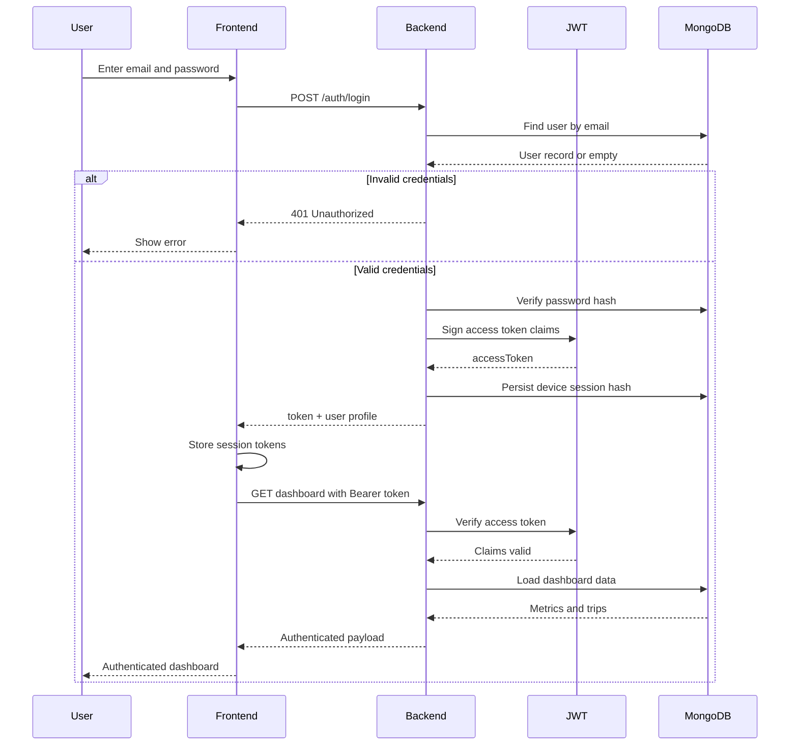

---

## 2. AI Itinerary Generation

Trip preferences are checked against Redis first. On a miss, Gemini/OpenAI generates the plan; the result is cached, saved to MongoDB, and returned to the client.

**Actors:** User · Frontend · Backend · Redis · Gemini/OpenAI · MongoDB

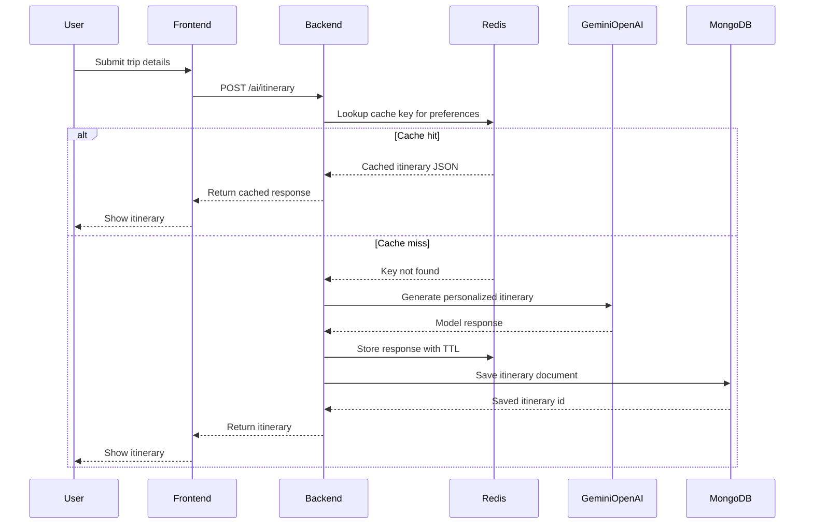

---

## 3. Expense Tracker Flow

Adding an expense persists to MongoDB, invalidates related Redis cache entries, refreshes analytics aggregates, and returns an updated expense/budget dashboard.

**Actors:** User · Frontend · Backend · MongoDB · Redis

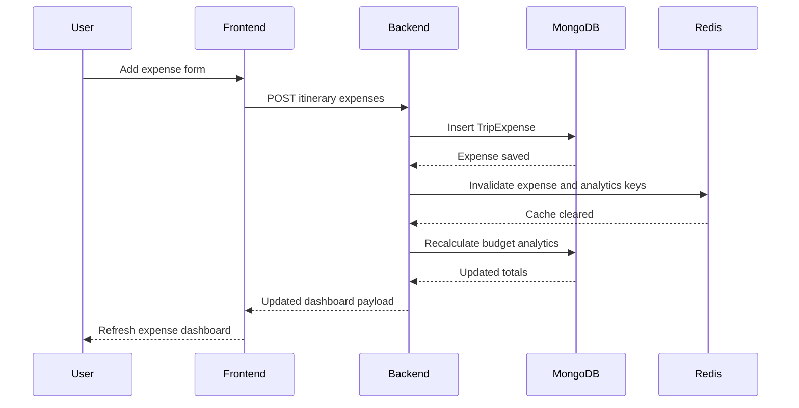

---

## 4. Booking Management Flow

Booking/availability search consults Redis, calls the flight (or availability) API on miss, stores results in Redis and MongoDB, then returns booking data to the user.

**Actors:** User · Frontend · Backend · Redis · MongoDB · Flight API

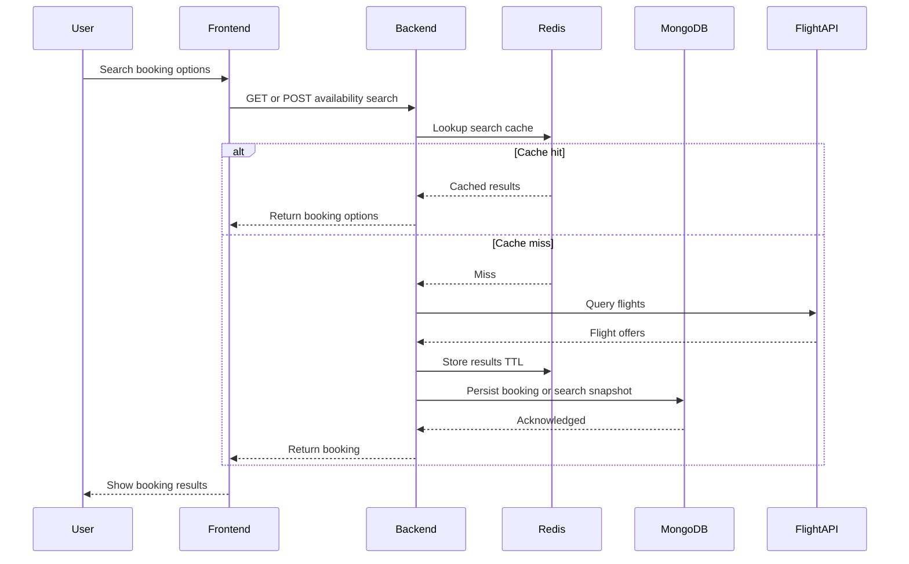

---

## 5. Weather Request Flow

Weather requests are served from Redis when possible; otherwise OpenWeather is called, the response is cached, and weather is returned to the UI.

**Actors:** User · Frontend · Backend · Redis · OpenWeather

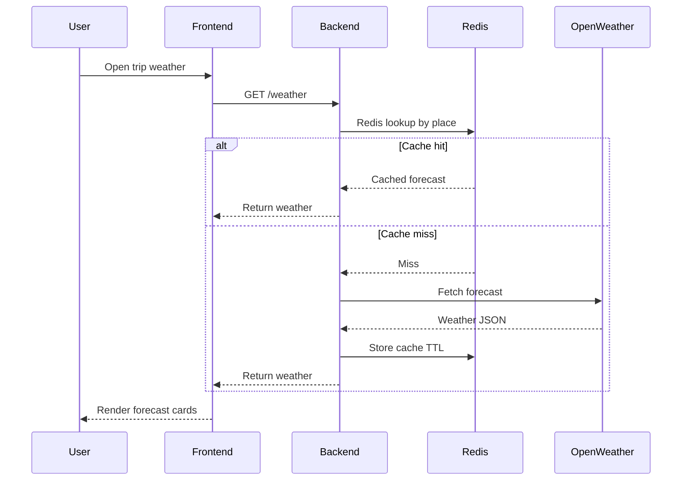

---

## 6. Google Maps Flow

Location search may be backed by Redis geocode/map caches; misses call Google Maps / Geocoding APIs, then cache and return map-ready coordinates to the frontend.

**Actors:** User · Frontend · Backend · Redis · Google Maps API

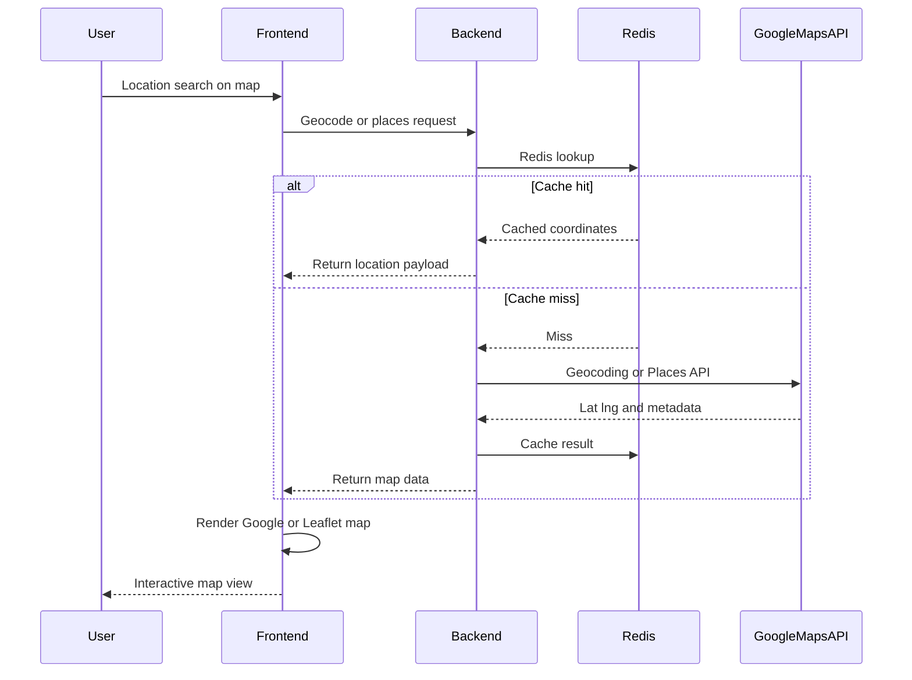

---

## 7. Document Upload Flow

Uploads are validated, stored in AWS S3, metadata is written to MongoDB, and success is returned to the Document Vault UI.

**Actors:** User · Frontend · Backend · AWS S3 · MongoDB

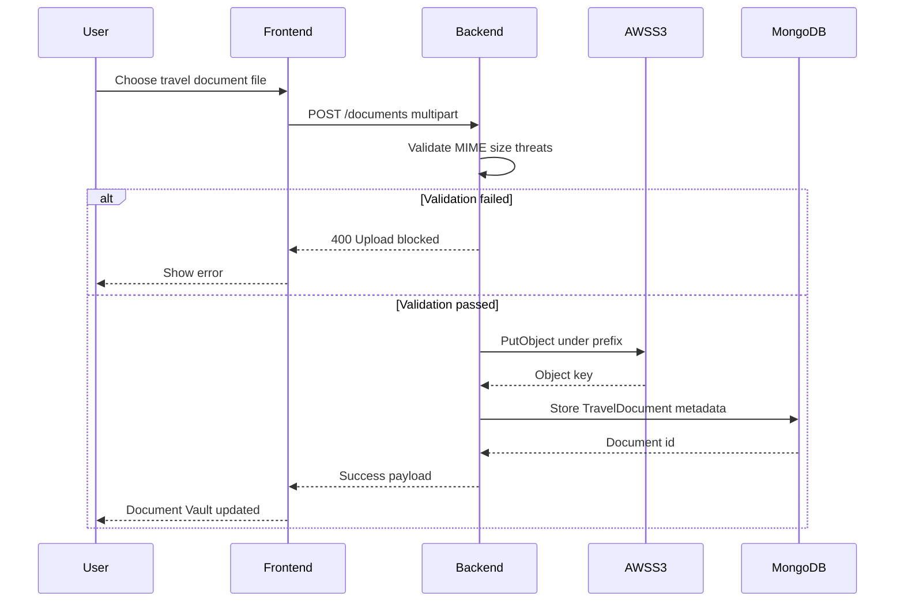

---

## 8. Notification Flow

Domain or scheduled events enqueue work through BullMQ, use Redis as the broker, and Socket.IO pushes realtime notifications to the browser.

**Actors:** Backend · BullMQ · Redis · Socket.IO · Frontend

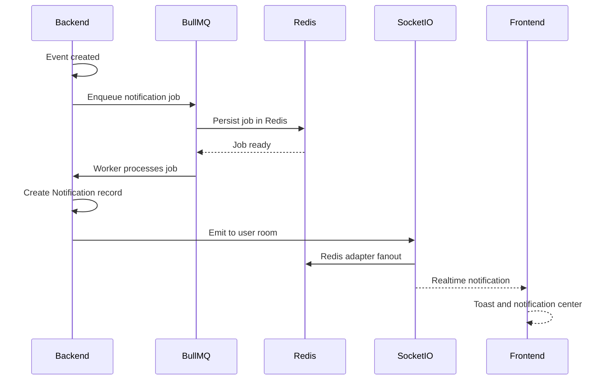

---

## 9. Event-Driven Architecture

Creating a trip publishes a domain event; notification, analytics, audit, Redis cache, and BullMQ subscribers run independently.

**Actors:** Trip Service · Event Bus · Notification Service · Analytics · Audit Logs · Redis · BullMQ

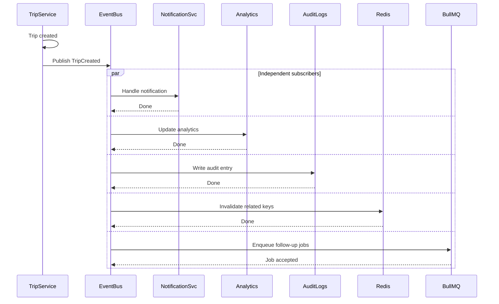

---

## 10. Admin Dashboard Flow

After admin authentication, the portal fetches metrics via the backend, prefers Redis where hot, consults monitoring services, and renders the dashboard.

**Actors:** Admin · Frontend · Backend · MongoDB · Redis · Monitoring

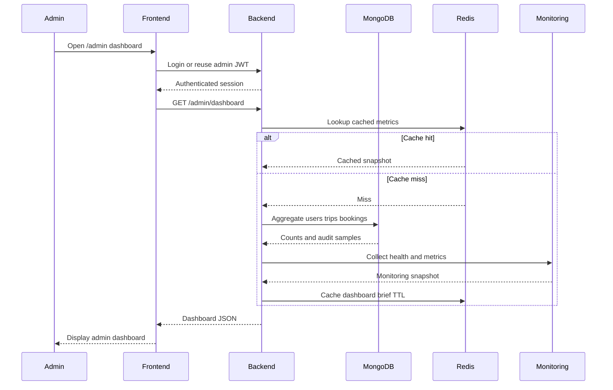

---

## 11. Travel Copilot Chat Flow

Copilot questions check Redis for similar/cached answers, call Gemini/OpenAI on miss, cache the reply, persist the conversation in MongoDB, and stream or return the answer.

**Actors:** User · Frontend · Backend · Redis · Gemini/OpenAI · MongoDB

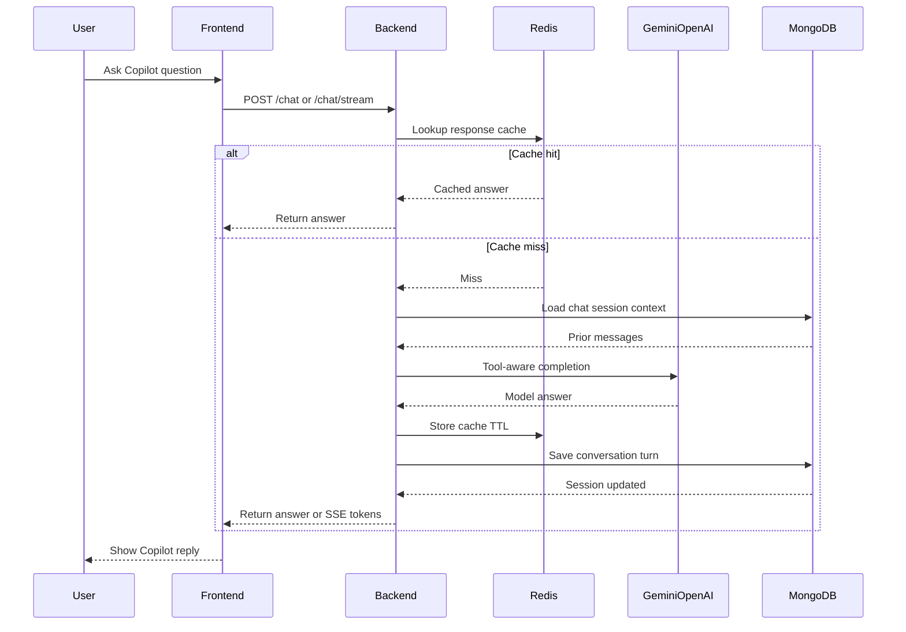

---

## 12. Flight Tracking Flow

Tracking a flight uses Redis for the latest status, calls the flight API on miss, stores cache, schedules BullMQ background refresh, and returns status to the UI.

**Actors:** User · Frontend · Backend · Redis · Flight API · BullMQ

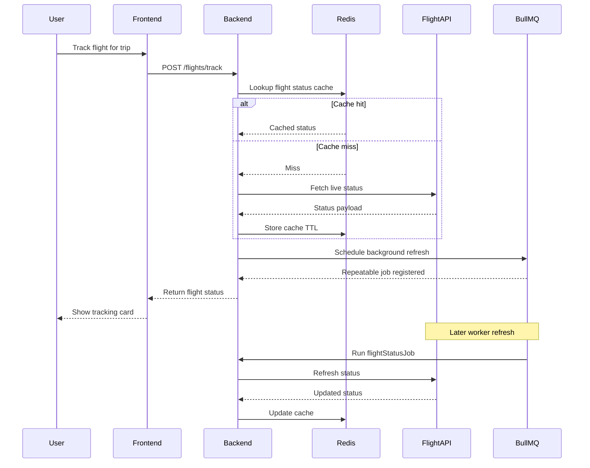

---

## How these diagrams help

### Documentation

- Give newcomers a **shared visual language** for cross-cutting flows without reading every controller.
- Complement `README.md` and `ARCHITECTURE.md` with **request-level** detail (who calls whom, and in what order).
- Make onboarding, handoffs, and RFCs faster: each diagram maps cleanly to routes such as `/auth`, `/ai`, `/documents`, and `/chat`.

### Interviews and system design discussions

- Demonstrate that TravelPlan is a **real production architecture** (JWT, Redis cache/aside, S3, queues, websockets, event bus)—not a CRUD toy.
- Help you narrate **trade-offs**: cache hit vs miss, async notification vs sync REST, background flight refresh vs user wait time.
- Support whiteboard practice: you can redraw any of these on a sequence-diagram frame during architecture interviews.

### Team communication

- Align frontend and backend on **contracts** (payloads after auth, after AI generation, after upload).
- Clarify **failure paths** (401, validation blocked, rate limits omitted here but easy to extend).
- Serve as living docs: update a diagram when a flow changes instead of burying behavior in chat history.

---

## Related docs

| Document | Content |
|----------|---------|
| [ARCHITECTURE.md](./ARCHITECTURE.md) | High-level Mermaid flowcharts |
| [README.md](./README.md) | Product overview and setup |
| [SECURITY.md](./SECURITY.md) | Auth, headers, rate limits |
| [EVENTS.md](./EVENTS.md) | Domain Event Bus catalogue |
| [JOBS.md](./JOBS.md) | BullMQ queues and workers |
